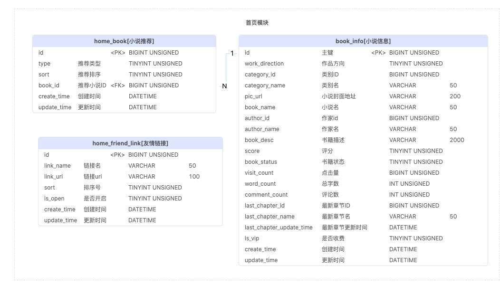
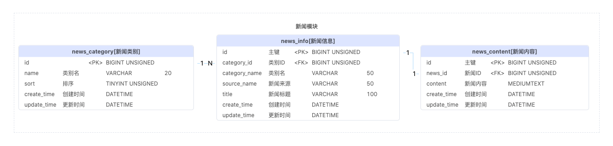
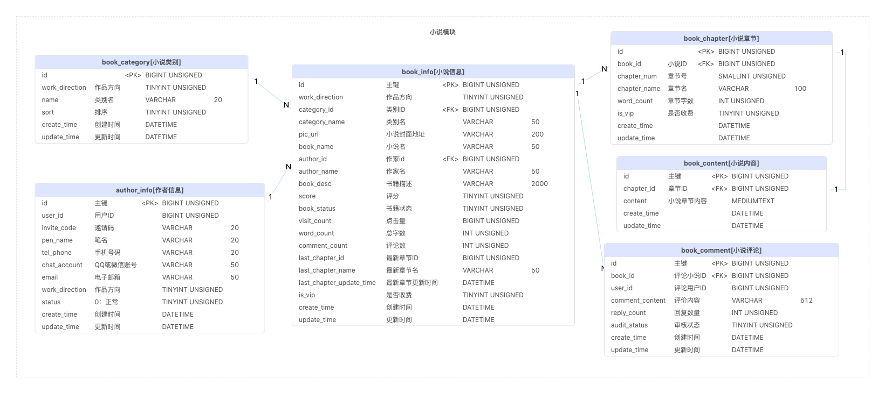
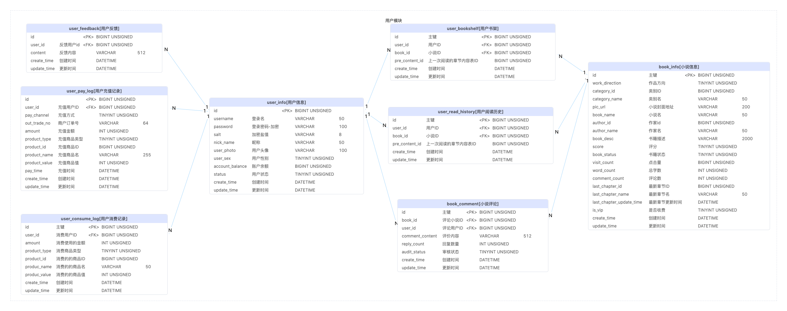
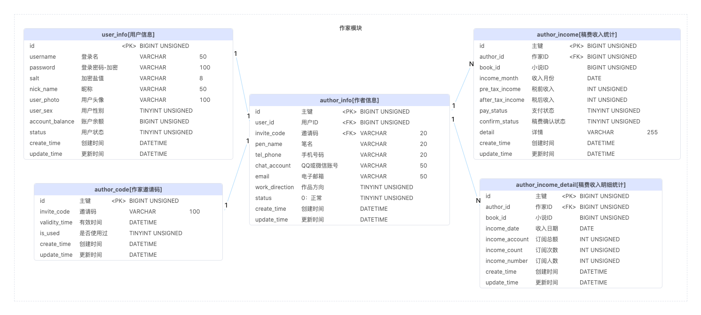

# Literary Snowlands

**项目名称：** Literary Snowlands  
**技术栈：** GoFrame、Vue.js、MySQL、Redis  
**项目类型：** 在线小说网站

## 项目描述

这个项目是我在借鉴了他人的Java代码的基础上，用GoFrame和Vue.js重新实现的一个在线小说管理系统。项目从零开始搭建，完成了包括后端服务、数据库设计、前端界面以及数据缓存等多个模块。该项目的主要功能如下：

## 项目功能

1. **用户管理**
    - 实现了用户注册、登录、获取验证码等功能，使用JWT进行身份验证和授权，确保用户数据安全。

2. **小说管理**
    - 用户可以发布小说和章节，编辑和删除已发布的内容，查看小说详情和章节列表。

3. **评论系统**
    - 用户可以对小说进行评论，查看最新评论，并回复评论。

4. **搜索功能**
    - 提供多条件搜索小说的功能，包括按关键词、类别、状态等条件进行搜索。

5. **排行榜功能**
    - 显示小说的点击榜、新书榜、更新榜等排行榜，帮助用户发现热门小说。

## 我的职责

- **后端开发：**
    - 使用GoFrame框架编写了API接口，包括用户认证、小说发布、章节管理等功能模块。

- **数据库设计：**
    - 设计并实现了MySQL数据库表结构，优化了数据查询性能。

- **前端开发：**
    - 使用Vue.js实现了用户界面，确保前后端数据交互的顺畅。

- **性能优化：**
    - 使用Redis缓存热门数据，提升系统响应速度和并发处理能力。

## 项目亮点

- **高性能：**
    - 利用GoFrame的高效性能，以及Redis缓存，确保了系统在高并发情况下的稳定运行。

- **安全性：**
    - 采用JWT进行用户身份验证，确保用户数据安全。

- **代码复用：**
    - 在借鉴他人Java代码的基础上，优化并实现了自己的Go版本，提高了代码的可维护性和复用性。

## 技术细节

- **后端：**
    - 使用GoFrame框架，实现RESTful API接口，处理用户请求和数据交互。

- **前端：**
    - 使用Vue.js框架，实现响应式用户界面，确保用户体验流畅。

- **数据库：**
    - 使用MySQL存储用户数据和小说数据，设计优化了表结构和索引，提高了查询效率。

- **缓存：**
    - 使用Redis缓存热门数据，减少数据库查询次数，提升系统性能。

## 数据库设计






## 代码结构

```shell
.
├── Makefile
├── README.MD
├── api
│   ├── backend
│   │   ├── backend.go
│   │   └── v1
│   │       ├── author.go
│   │       └── chapter.go
│   └── frontend
│       ├── frontend.go
│       └── v1
│           ├── book.go
│           ├── home.go
│           ├── news.go
│           ├── search.go
│           ├── user.go
│           └── utils.go
├── go.mod
├── go.sum
├── hack
│   ├── config.yaml
│   ├── hack-cli.mk
│   └── hack.mk
├── internal
│   ├── cache
│   │   └── book_cache.go
│   ├── cmd
│   │   └── cmd.go
│   ├── consts
│   │   ├── cache.go
│   │   └── consts.go
│   ├── controller
│   │   ├── backend
│   │   │   └── author.go
│   │   └── frontend
│   │       ├── book.go
│   │       ├── home.go
│   │       ├── news.go
│   │       ├── search.go
│   │       ├── user.go
│   │       └── util.go
│   ├── dao
│   │   ├── author_code.go
│   │   ├── author_income.go
│   │   ├── author_income_detail.go
│   │   ├── author_info.go
│   │   ├── book_category.go
│   │   ├── book_chapter.go
│   │   ├── book_comment.go
│   │   ├── book_comment_copy_1.go
│   │   ├── book_comment_reply.go
│   │   ├── book_content.go
│   │   ├── book_info.go
│   │   ├── home_book.go
│   │   ├── home_friend_link.go
│   │   ├── internal
│   │   │   ├── author_code.go
│   │   │   ├── author_income.go
│   │   │   ├── author_income_detail.go
│   │   │   ├── author_info.go
│   │   │   ├── book_category.go
│   │   │   ├── book_chapter.go
│   │   │   ├── book_comment.go
│   │   │   ├── book_comment_copy_1.go
│   │   │   ├── book_comment_reply.go
│   │   │   ├── book_content.go
│   │   │   ├── book_info.go
│   │   │   ├── home_book.go
│   │   │   ├── home_friend_link.go
│   │   │   ├── news_category.go
│   │   │   ├── news_content.go
│   │   │   ├── news_info.go
│   │   │   ├── pay_alipay.go
│   │   │   ├── pay_wechat.go
│   │   │   ├── sys_log.go
│   │   │   ├── sys_menu.go
│   │   │   ├── sys_role.go
│   │   │   ├── sys_role_menu.go
│   │   │   ├── sys_user.go
│   │   │   ├── sys_user_role.go
│   │   │   ├── test.go
│   │   │   ├── user_bookshelf.go
│   │   │   ├── user_comment.go
│   │   │   ├── user_comment_reply.go
│   │   │   ├── user_consume_log.go
│   │   │   ├── user_feedback.go
│   │   │   ├── user_info.go
│   │   │   ├── user_pay_log.go
│   │   │   └── user_read_history.go
│   │   ├── news_category.go
│   │   ├── news_content.go
│   │   ├── news_info.go
│   │   ├── pay_alipay.go
│   │   ├── pay_wechat.go
│   │   ├── sys_log.go
│   │   ├── sys_menu.go
│   │   ├── sys_role.go
│   │   ├── sys_role_menu.go
│   │   ├── sys_user.go
│   │   ├── sys_user_role.go
│   │   ├── test.go
│   │   ├── user_bookshelf.go
│   │   ├── user_comment.go
│   │   ├── user_comment_reply.go
│   │   ├── user_consume_log.go
│   │   ├── user_feedback.go
│   │   ├── user_info.go
│   │   ├── user_pay_log.go
│   │   └── user_read_history.go
│   ├── logic
│   │   ├── author
│   │   │   └── author.go
│   │   ├── book
│   │   │   └── book.go
│   │   ├── home
│   │   │   └── home.go
│   │   ├── logic.go
│   │   ├── middleware
│   │   │   └── middleware.go
│   │   ├── news
│   │   │   └── news.go
│   │   ├── search
│   │   │   └── search.go
│   │   └── user
│   │       └── user.go
│   ├── model
│   │   ├── author.go
│   │   ├── book.go
│   │   ├── do
│   │   │   ├── author_code.go
│   │   │   ├── author_income.go
│   │   │   ├── author_income_detail.go
│   │   │   ├── author_info.go
│   │   │   ├── book_category.go
│   │   │   ├── book_chapter.go
│   │   │   ├── book_comment.go
│   │   │   ├── book_comment_copy_1.go
│   │   │   ├── book_comment_reply.go
│   │   │   ├── book_content.go
│   │   │   ├── book_info.go
│   │   │   ├── home_book.go
│   │   │   ├── home_friend_link.go
│   │   │   ├── news_category.go
│   │   │   ├── news_content.go
│   │   │   ├── news_info.go
│   │   │   ├── pay_alipay.go
│   │   │   ├── pay_wechat.go
│   │   │   ├── sys_log.go
│   │   │   ├── sys_menu.go
│   │   │   ├── sys_role.go
│   │   │   ├── sys_role_menu.go
│   │   │   ├── sys_user.go
│   │   │   ├── sys_user_role.go
│   │   │   ├── test.go
│   │   │   ├── user_bookshelf.go
│   │   │   ├── user_comment.go
│   │   │   ├── user_comment_reply.go
│   │   │   ├── user_consume_log.go
│   │   │   ├── user_feedback.go
│   │   │   ├── user_info.go
│   │   │   ├── user_pay_log.go
│   │   │   └── user_read_history.go
│   │   ├── entity
│   │   │   ├── author_code.go
│   │   │   ├── author_income.go
│   │   │   ├── author_income_detail.go
│   │   │   ├── author_info.go
│   │   │   ├── book_category.go
│   │   │   ├── book_chapter.go
│   │   │   ├── book_comment.go
│   │   │   ├── book_comment_copy_1.go
│   │   │   ├── book_comment_reply.go
│   │   │   ├── book_content.go
│   │   │   ├── book_info.go
│   │   │   ├── home_book.go
│   │   │   ├── home_friend_link.go
│   │   │   ├── news_category.go
│   │   │   ├── news_content.go
│   │   │   ├── news_info.go
│   │   │   ├── pay_alipay.go
│   │   │   ├── pay_wechat.go
│   │   │   ├── sys_log.go
│   │   │   ├── sys_menu.go
│   │   │   ├── sys_role.go
│   │   │   ├── sys_role_menu.go
│   │   │   ├── sys_user.go
│   │   │   ├── sys_user_role.go
│   │   │   ├── test.go
│   │   │   ├── user_bookshelf.go
│   │   │   ├── user_comment.go
│   │   │   ├── user_comment_reply.go
│   │   │   ├── user_consume_log.go
│   │   │   ├── user_feedback.go
│   │   │   ├── user_info.go
│   │   │   ├── user_pay_log.go
│   │   │   └── user_read_history.go
│   │   ├── home.go
│   │   ├── news.go
│   │   ├── search.go
│   │   └── user.go
│   ├── packed
│   │   └── packed.go
│   └── service
│       ├── author.go
│       ├── book.go
│       ├── home.go
│       ├── middleware.go
│       ├── news.go
│       ├── search.go
│       └── user.go
├── main.go
├── manifest
│   ├── config
│   │   └── config.yaml
│   ├── deploy
│   │   └── kustomize
│   │       ├── base
│   │       │   ├── deployment.yaml
│   │       │   ├── kustomization.yaml
│   │       │   └── service.yaml
│   │       └── overlays
│   │           └── develop
│   │               ├── configmap.yaml
│   │               ├── deployment.yaml
│   │               └── kustomization.yaml
│   ├── docker
│   │   ├── Dockerfile
│   │   └── docker.sh
│   ├── i18n
│   └── protobuf
├── project_class_diagram.puml
├── resource
│   ├── public
│   │   ├── html
│   │   ├── plugin
│   │   └── resource
│   │       ├── css
│   │       ├── image
│   │       └── js
│   └── template
└── utility
    ├── colly
    │   └── colly.go
    └── utils.go

50 directories, 195 files
